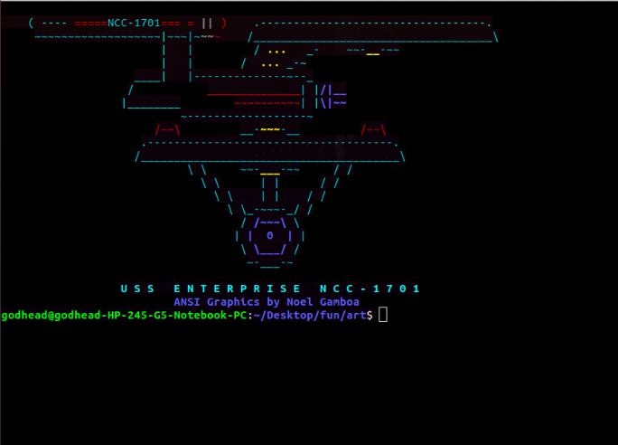

<p align="center">

</p>


## *Art from 80's and 90's*

*This repo contains the art work which you can use in you terminal.*


```
1. Run the  build script to create url's json file
 
 python3 build
 
2. Enter the Key Word and get artwork.

 python3 art

```

**OR**

```
$ Run the run file for everything
 
 ./run

```
